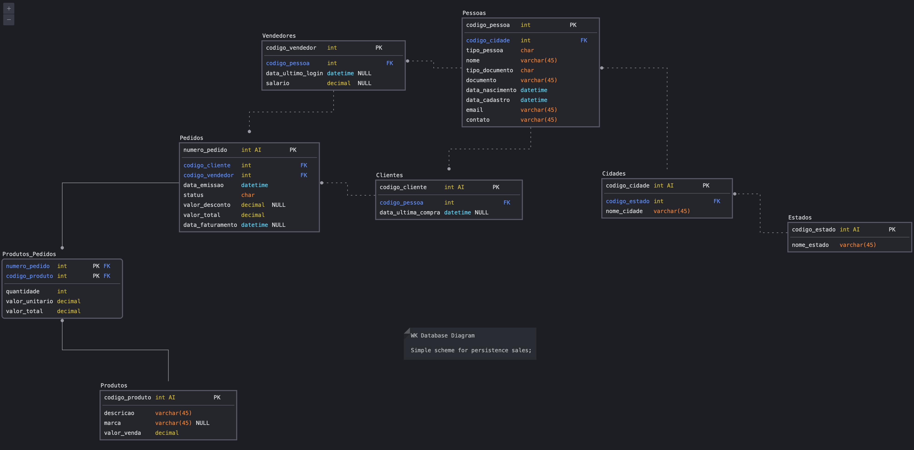

# WK-orders

## Descrição
Projeto de demonstração de habilidades ténicas para processo seletivo da empresa WK Technology;

## Especificações
Este projeto segue os seguintes conceitos:
* Designe Patterns;
* Clean Code;
* Orientação a Objetos;
* Tem na implementação o ideal de manter o equilibrio entre:
  * Complexibilidade: Codigo enxuto, elegante e com complexidade assintótica baixa;
  * Manutenabilidade: Reutilização de código com objetos bem definidos e estruturados;
  * Conformidade: Implementa o conceitos de camadas onde cada etapa e responsável por suas taregas específicas;

## Detalhes
### Database

O Banco de dados está esquematizado de forma simples. Implementa conceitos de índices e chaves estrangeiras para manter a integridade dos dados e distribui as informações da melhor for possível para garantir performance e acessibilidade, segue esquema (UML) da base de dados implementadas:

O Banco de Dados utilizados foi um Banco de Dados Relacional de linguagem SQL. Atualmente está hospedado na Azure e possui acesso gratuíto por tempo definido. Para solicitar acesso as credenciais e realizar testes sobre a aplicação, solicite via email para : marcos.v.silva@live.com

Os arquivos para replilcação da base de dados estão disponíveis em:
 * [Criação: Linguagem SQL;](Docs/gen_WK.sql)
 * [População: Linguagem SQL;](Docs/pop_WK.sql)

### Arquitetura

O Banco de dados utiliza a arquitetura MVC como padrão de projeto arquitetural:
* Model:
  * As classes de modelo que representa as entidades envolvidas no contexto do projeto. Apresenta seus atributos e onde são implementas as regras de negócio a nível de contexto;
* DAO:
  * Camada de persistência da aplicação. Realiza o CRUD da aplicação ao Banco de Dados (Create, Read, Update, Delete).
* Controler:
  * Camada de interação entre as entidades o que é exibido e manipulado pelo usuário. Implementa a comunicação entre o Banco de Dados e a interface do usário. Implementa as regras de negócio a nível de validação e integridade dos dados a nível ténico;
* View:
  * Parte de interação com o usário. Possui as telas que o usuário visualiza e interage.
  
### Ambiente:

* Ferramentas:
  * Banco de Dados: MySQL Versão 5.7 (Azure Cloud);
  * Ambiente de Desenvolvimento: Embarcadero® Delphi 11.2 (Trial Version);
  * Sistema Operacional (Virtualizado): Windows 11 Home, Version	22H2;
  * Virtualizador: Parallels Version 18.0.2;
  * Sistema Operacional: macOS 12.5.1 (Monterey) (21G83);
  * Hardware: MacBookPro (16-inch, 2021), Chip:	Apple M1 Pro, 16 GB;

